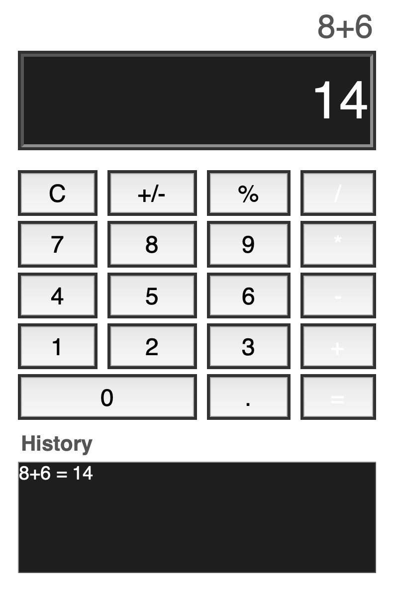

# Simple-Calculator
This project contains a lightweight, GUI-based calculator built with Python and Tkinter that supports basic arithmetic operations and a history panel.



## Installation
1. Clone the repository ```git clone https://github.com/jaelyntran/Simple-Calculator```
   
2. After cloning, navigate to the new directory ```cd Simple-Calculator```

3. Run the calculator locally ```python main.py```

* (Note: Requires Python 3.10+ with Tkinter, which comes preinstalled in most distributions.)

## Usage
Enter expressions directly in the display or use the buttons to input numbers and operations. Press Enter or = to calculate.

### Valid Input Rules:  
- The equation **cannot start** with `+`, `*`, `/`, or `%`.  
- The equation **may start** with `-`, but only if it is followed by a number (to allow negative numbers).  
- The equation **cannot end** with `+`, `-`, `*`, or `/`.  
- Two operators **cannot appear in a row**, unless the second operator is `-` (to allow things like `3 * -2`).  
- A `%` operator must always be **followed by a number**.  

## How It Works
- `parse_equation(user_input)`: Validates and parses the user input into numbers, operators, and percentages.
- `calculate_expression(expression)`: Computes the result respecting operator precedence (`*` & `/` before `+` & `-`).
- The GUI is handled in simple_calculator_ui.py using Tkinter widgets.
- The last 5 calculations are stored in memory and displayed in the history panel.

## Features
- Perform addition, subtraction, multiplication, division.
- Handle percentages (e.g., 50% converts to 0.5).
- Support negative numbers and decimal values.
- Keep a history of the last 5 calculations.
- Intuitive and responsive GUI with simple styling.

## Known Issues / Limitations
- Does not handle parentheses or advanced math functions.
- '%' is treated as "divide by 100," not as "percentage of the previous number."
- Tkinter’s button styling may vary across operating systems (e.g., macOS may ignore custom background colors).

## Takeaway
- Building this project reinforced the importance of input validation to prevent invalid or unsafe expressions from being processed.
- Designing the calculator around separation of concerns (parsing, computation, and GUI) made the code cleaner, more modular, and easier to extend.
- Working with Tkinter showed the tradeoffs of GUI development in Python. It is simple to set up, but requires careful handling of layout managers and cross-platform quirks.
